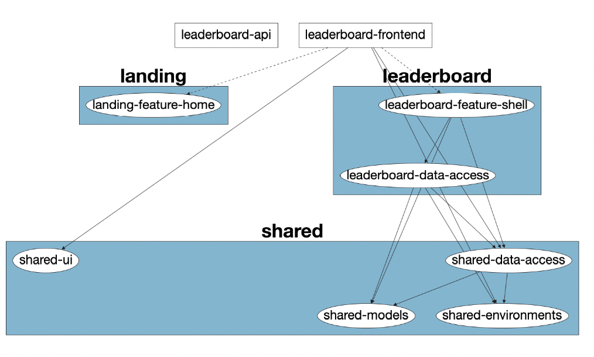

Leaderboard solution is a Monorepo using [Nx](https://nx.dev). In This solution we have two main applications [leaderboard-frontend](#Understand-your-workspace) and [leaderboadr-api](#Understand-your-workspace) with a set of libraries and libraries group with different types and scopes. for more info [Understand your workspace](#Understand-your-workspace)

# Table of content

1. [Installation](#Installation)
2. [Development environment](#Development)
3. [Understand your workspace](#Understand-your-workspace)

---

# Installation

```
npm install
```

# Development

## Starting both frontend and backend

```
npm run start
```

- `npm run start` will run both the froneend and the API.
- Navigate to [http://localhost:4200](http://localhost:4200/docs)
  for the frontend.
- API Swagger Documentation [http://localhost:5000/docs](http://localhost:5000/docs).
- The frontend will automatically reload if you change any of the frontend source files and the same for the backend.

### Backend Development

```
npm run dev:api
```

- `npm run dev:api` will run the Api in dev mode on port 5000
- The api will automatically reload if you change any of the source code and same for Swagger spec.
- API Swagger Documentation [http://localhost:5000/docs](http://localhost:5000/docs).


*** 

## Build

Run `npm run affected:build` to build the affected projects and libraries after changing in the source code.

---

## Running unit tests

Run `ng test my-app` to execute the unit tests via [Jest](https://jestjs.io).

Run `nx affected:test` to execute the unit tests affected by a change.

---

## Understand your workspace

Run `nx dep-graph` to see a diagram of the dependencies of your projects and libraries.


<p align="center"></p>

### Applications

- #### `leaderboard-frontend`

  A Front-end shell for the application features. It has no logic everything handled by feature libraries.

- #### `leaderboard-Api`
  REST API with Node.js and Express.js (Typescript)

### Libraries & Libraries group:

- `shared` `(Library group)`
  > A group of shared libraries that are commonly used accross the solution applications and libraries
  - `data-access` (Angular Library)
    > Common entities data access. EX: Users Entity Store
  - `environment` (Typescript Library)
    > Typescript library to manage solution environment configuration
  - `models` (Typescript Library)
    > Typescript library for the common entities models. EX: User interface
  - `ui` (Angular Library)
    > Shared presentation components. EX: header, layout...
- `landing` `(Library group)`
  > A group of libraries for the landing feature EX: Home feature, about Us...
  - `feature-home` (Angular Library)
    > Home feature library
- `leaderboard` `(Library group)`
  > A group of libraries for the leaderboard features
  - `data-access` (Angular Library)
    > Leaderboard entities and data access
  - `feature-shell` (Angular Library)
    > Leaderboard shell library, to group all about leaderboard feature and handling feature routing
